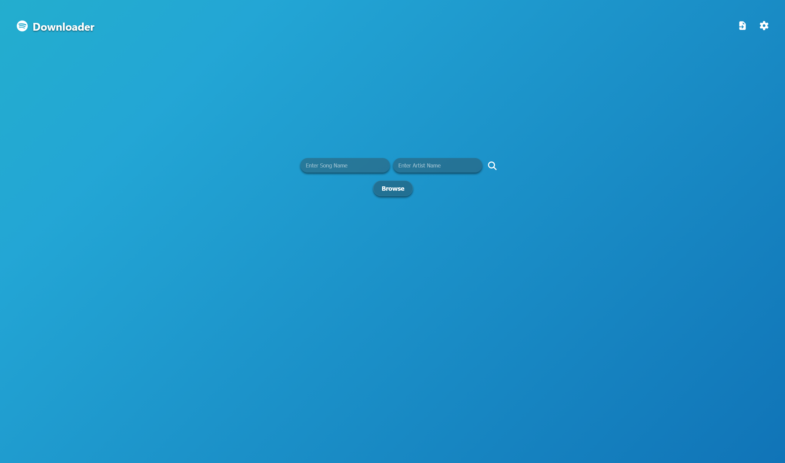
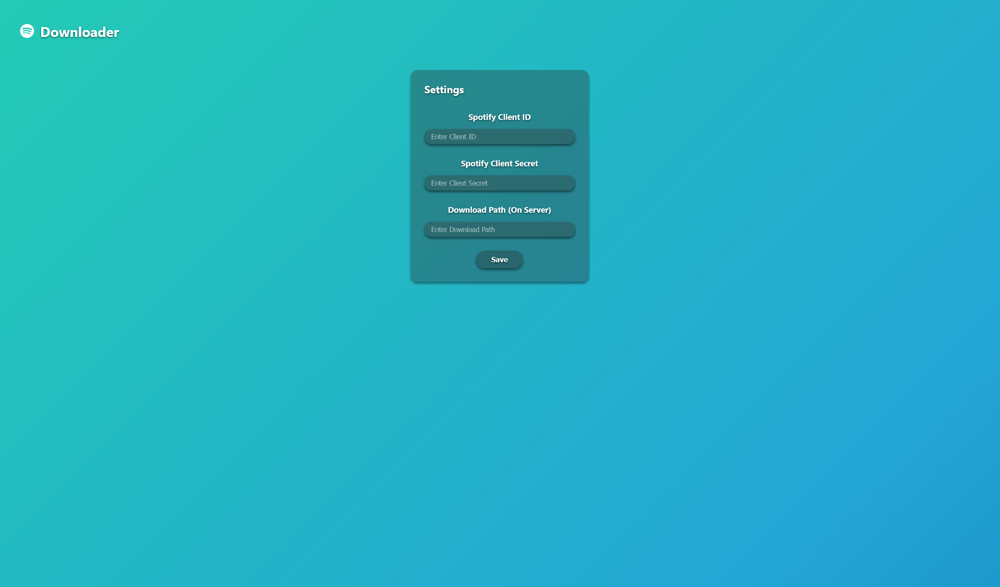
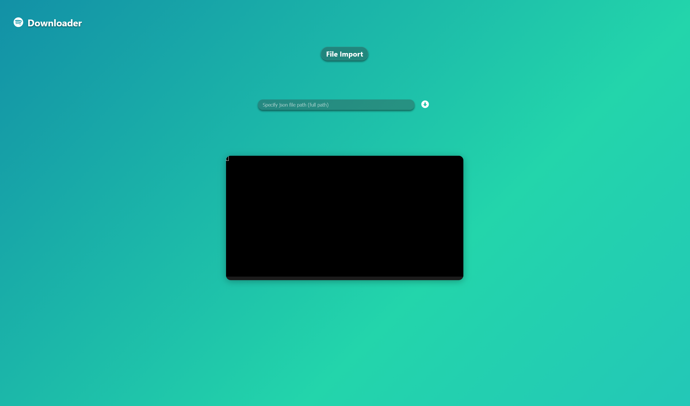
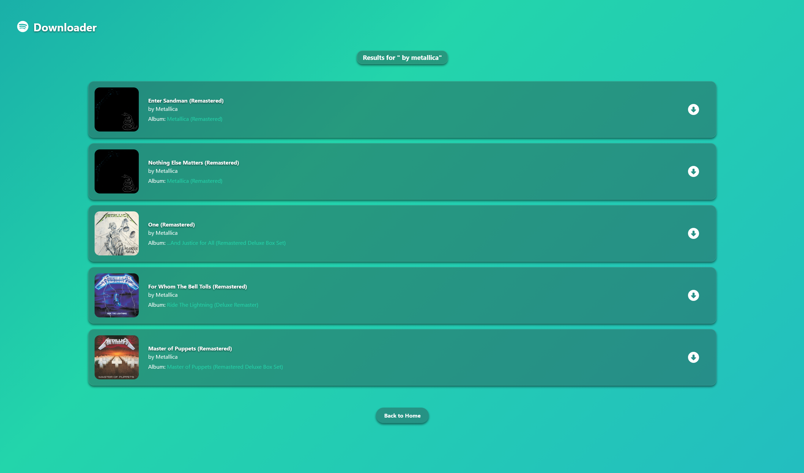
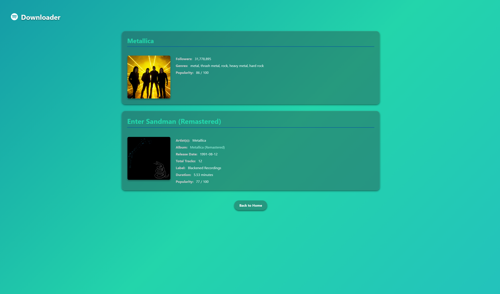

# Web Branch
This is the web version of branch for CLI-Spotify-Downloader. This branch builds off the dev branch to create a web viewer for Spotify Downloader. Please read dev's & main's readme.md for the required knowledge to deploy this.

# Web Version of Spotify Downloader
The web version of spotify downloader has the same download process as the CLI verison. But with a few extra features.

### Use Cases
There are many use cases for this type of program. I personally use it on my plex server and download songs to the path plex looks for. There are many other ways to utilize this I'd imagine.

## Home Page

## Settings Page
The settings page is the front end way of modifying your .env file. Your spotify API keys go here as well as your download path of the device running the web server.

## Import Page
The import page works by inputting your json file's path (of the device running web server) into the text box above and it will start downloading multiple songs with output via the terminal below.

## Results Page
The results page only shows the top 5 songs searched (via song name and artist) with quick actions like downlading the song, or you can view the about song by clicking the card or click the album name for the album page.

### Things to add here
- [ ] Page Feature to browse further

## About Page
The about page just shows a little more about the song. Most likely will be changed up visually next.

## Album Page
The album page just lists all songs within the selected album with quick acess to download a selected song.

## Download Page
The download page is just like the import page. It shows a terminal with the output of the download process. Currently you can download only one song at a time (if you want to download more than one use the import feature).